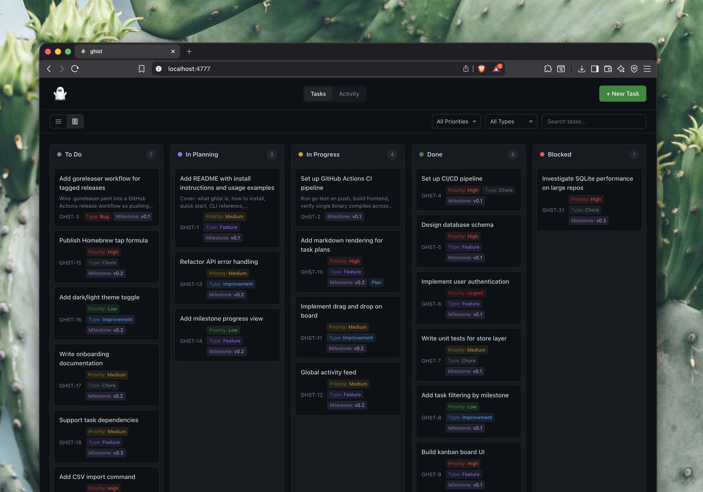
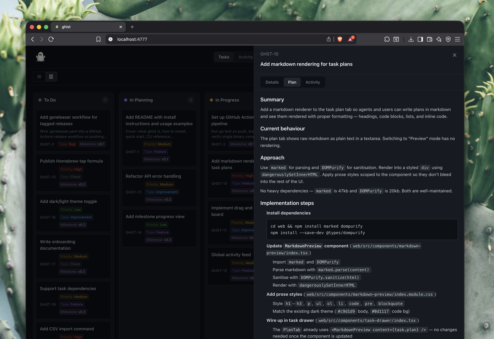

<p align="center">
  
</p>

<h1 align="center">Ghist</h1>

<p align="center">
  <strong>Task management that lives in your repo. With persistent memory.</strong><br/>
  A local-first CLI that brings your project backlog close to your code. Tasks, plans, and decisions persist across sessions so your coding agent always knows what's been done, what's in progress, and why certain choices were made.
</p>

<p align="center">
  <a href="#quickstart">Quickstart</a> &middot;
  <a href="#why">Why</a> &middot;
  <a href="#how-it-works">How It Works</a> &middot;
  <a href="#commands">Commands</a> &middot;
  <a href="#skills">Skills</a> &middot;
  <a href="#web-ui">Web UI</a> &middot;
  <a href="#building-from-source">Building</a>
</p>

<p align="center">
  
</p>

---

## Why

Jira and Linear are great tools. But they live outside your repo, require auth and API setup to use programmatically, and weren't built with coding agents in mind. Ghist takes a different approach — tasks live in `.ghist/` right next to your code, with a simple CLI that any agent can use out of the box.

It's a good fit for indie developers, small teams, and solo AI-assisted projects. If you're running a large engineering org with dedicated project managers, you probably want Jira.

- **Repo-native.** Tasks and decisions are versioned alongside your code, no accounts or external services
- **Agent-operable.** The full CLI is available to any coding agent that can run a command
- **Plans survive sessions.** Write a plan before a session ends and the next agent picks up exactly where you left off
- **Decisions get captured.** Log the reasoning behind choices so future sessions don't re-debate the same trade-offs

No cloud. No accounts. Just a SQLite database in `.ghist/` and a CLI your agent already knows how to use.

## Quickstart

```bash
brew install unnecessary-special-projects/tap/ghist
```

**Linux / Windows:** Download the latest binary from [GitHub Releases](https://github.com/unnecessary-special-projects/ghist/releases).

Initialize ghist in your project:

```bash
ghist init
```

From here your agent will run this automatically at the start of each session:

```bash
ghist status
```

To open the web UI:

```bash
ghist serve
```

Then open `http://localhost:4777`.

`ghist init` creates a `.ghist/` directory and injects a small block into your `CLAUDE.md` (or `AGENTS.md`, `.cursorrules`, etc.) that tells the agent to sync with ghist at the start of every session.

## In Practice

### Migrating from Linear or Jira

If you have an existing backlog, you don't have to start from scratch. Export it as a CSV from Linear or Jira, drop the file in your repo, and tell your agent to import it.

> "I've dropped my Linear export at `linear-export.csv`. Add all the tasks to ghist."

The agent reads the file and runs `ghist task add` for each row, mapping titles, descriptions, priorities, and statuses. Your entire backlog is in ghist in seconds.

### Starting a task

Tell your agent to work on something and it handles the full lifecycle.

> "Work on the user authentication feature."

The agent finds the task, moves it to `in_planning`, writes out a plan with its approach and the files it intends to change, then moves to `in_progress` and starts executing. The plan is saved to the task so if the session ends mid-way, the next agent reads it and continues without needing to be re-briefed.

### Picking up where you left off

At the start of every session the agent runs `ghist status` and reads the current project state.

```
$ ghist status
Project Status
==============

Tasks: 8 total (2 todo, 1 in_progress, 5 done)

In Progress:
  #4  User authentication  [plan saved]

Recent Events:
  [2025-06-14 09:15] Started implementing JWT middleware
  [2025-06-14 09:02] Moved task #4 to in_progress
```

If there is an in-progress task with a saved plan, the agent reads it and continues from where the last session ended.

### Logging decisions

As the agent works it can log decisions and notes to the event timeline. These show up in `ghist status` so future sessions have the context they need without re-debating the same trade-offs.

```bash
ghist log "Using JWT over sessions, simpler for stateless API" --type decision --task 4
```

## How It Works

```
your-project/
  .ghist/
    ghist.sqlite          # source of truth — tasks, events, timeline
    current_context.json  # fast-cache updated after every mutation
  CLAUDE.md               # injected instructions for the AI agent
```

Ghist stores everything in a local SQLite database. After every mutation (task update, log entry), it writes a `current_context.json` snapshot so agents can quickly understand the current state without querying the DB directly.

The CLI is the primary interface — both for you and for the AI agent. Agents interact with ghist through the same commands you do.

## Commands

### Project

```bash
ghist init                  # Initialize ghist in current directory
ghist status                # Show project summary (tasks, milestones, events)
ghist status --json         # Machine-readable output
ghist refresh               # Re-run migrations and update config after upgrades
```

### Tasks

```bash
ghist task add "Title"                          # Create a task
ghist task add "Title" --description "Details"  # With description
ghist task add "Title" --milestone v1 --priority high --type feature

ghist task list                                 # List all tasks
ghist task list --status in_progress            # Filter by status
ghist task list --milestone v1 --priority high  # Filter by milestone/priority
ghist task list --json                          # JSON output

ghist task show <id>                            # Show task details + events
ghist task update <id> --status in_progress     # Update status
ghist task update <id> --commit-hash abc123     # Link a commit
ghist task delete <id>                          # Delete a task
```

**Statuses:** `todo` | `in_planning` | `in_progress` | `done` | `blocked`

**Priorities:** `low` | `medium` | `high` | `urgent`

**Types:** `bug` | `feature` | `improvement` | `chore`

### Plans

Plans are markdown documents attached to tasks. They survive session boundaries — if a session ends mid-task, the next agent reads the plan and picks up where you left off.



```bash
# Write a plan (via stdin)
cat <<'EOF' | ghist task update <id> --plan-stdin
## Approach
- Step 1: Add migration for new table
- Step 2: Implement API endpoint
- Step 3: Write tests

## Files to change
- internal/store/store.go — add migration
- internal/api/tasks.go — new endpoint
EOF
```

### Event Log

```bash
ghist log "Decided to use JWT for auth"           # Log a decision
ghist log "Completed API refactor" --task 5        # Link to a task
ghist log "Need to revisit caching" --type note    # Types: log, decision, note
```

### Skills

```bash
ghist skills list              # List available skills
ghist skills show context-sync # Read a skill's instructions
```

### Web UI

```bash
ghist serve                    # Start on :4777
ghist serve --port 8080        # Custom port
ghist serve --dev              # Dev mode (CORS enabled, proxies to Vite)
```

## Skills

Skills are behavioral instructions embedded in the ghist binary. They teach AI agents how to autonomously manage project state. When you run `ghist init`, a reference to these skills is injected into your agent's config file.

| Skill | Purpose |
|---|---|
| **context-sync** | Session start/end protocol — run `ghist status`, review tasks, log summaries |
| **task-workflow** | Task lifecycle — find, plan, execute, complete |
| **auto-completion** | Detect when a task is done based on signals (tests pass, commits made) |
| **log-thinking** | Record architectural decisions and reasoning for future sessions |

Read any skill with `ghist skills show <name>`.

## Web UI

Ghist includes a built-in web dashboard served from the single binary. Run `ghist serve` and open `http://localhost:4777`.

- **Kanban board** — drag-and-drop tasks between status columns
- **List view** — table-based overview with sorting
- **Task drawer** — create and edit tasks with inline field editing
- **Filters** — by priority, type, and search query
- **Markdown rendering** — task plans and descriptions render as rich text

## Supported Agents

Ghist auto-injects instructions into whichever agent config files exist in your project:

| Agent | Config File |
|---|---|
| Claude Code | `CLAUDE.md` |
| Cursor | `.cursorrules` |
| Windsurf | `.windsurfrules` |
| Cline | `.clinerules` |
| GitHub Copilot | `.github/copilot-instructions.md` |
| Any agent | `AGENTS.md` (always created) |

## Building from Source

Requires Go 1.22+ and Node.js 18+.

```bash
# Full build (frontend + Go binary)
make build

# Go binary only (without frontend)
make build-go

# Run tests
make test
```

## Architecture

Single binary. No CGO. No external dependencies at runtime.

- **Go** — CLI (Cobra), HTTP API (stdlib `net/http`), SQLite (`modernc.org/sqlite`)
- **React** — Web UI (Vite, TypeScript, `@dnd-kit` for drag-and-drop)
- **`//go:embed`** — Skills and web frontend are embedded in the binary

```
main.go                    # Entry point, embeds skills/ and web/dist/
cmd/                       # CLI commands (Cobra)
internal/
  store/                   # SQLite layer (migrations, CRUD)
  project/                 # Project detection, init, context updates
  api/                     # HTTP REST API + SPA serving
  models/                  # Data models
  output/                  # CLI formatting
skills/                    # Behavioral instructions for AI agents (embedded)
web/                       # React frontend (embedded in binary)
```

## License

MIT
